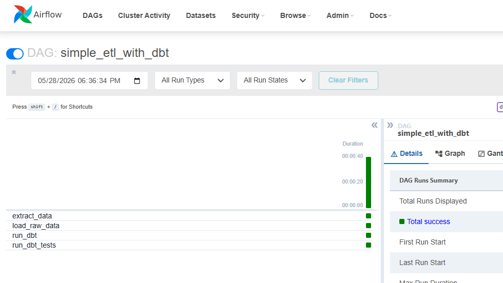
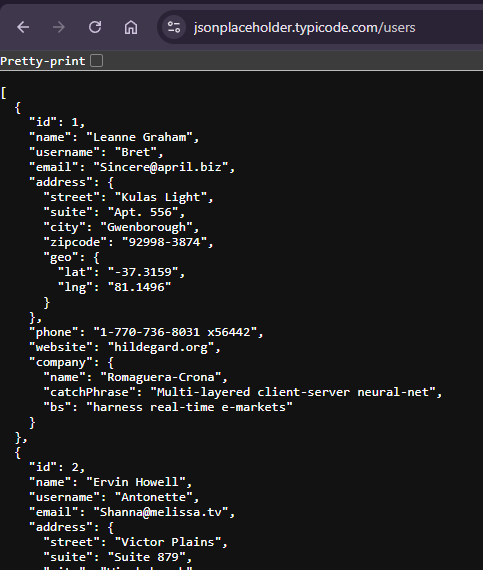
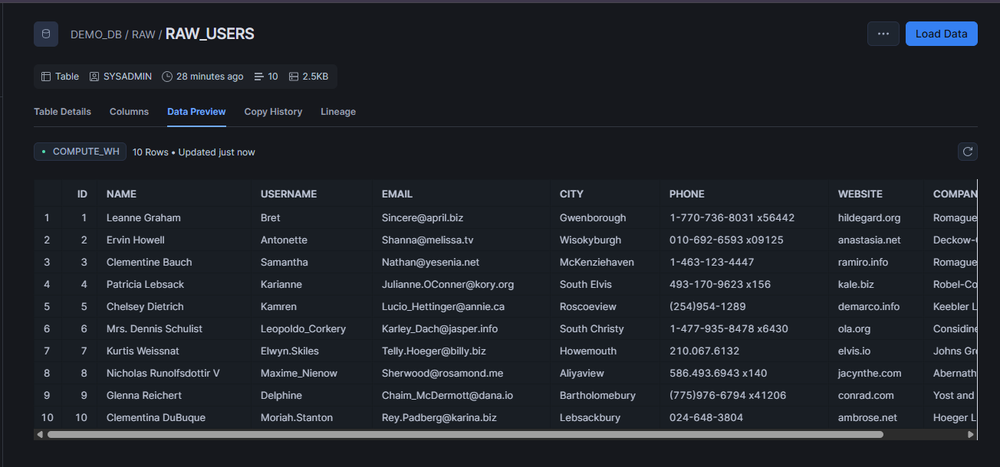
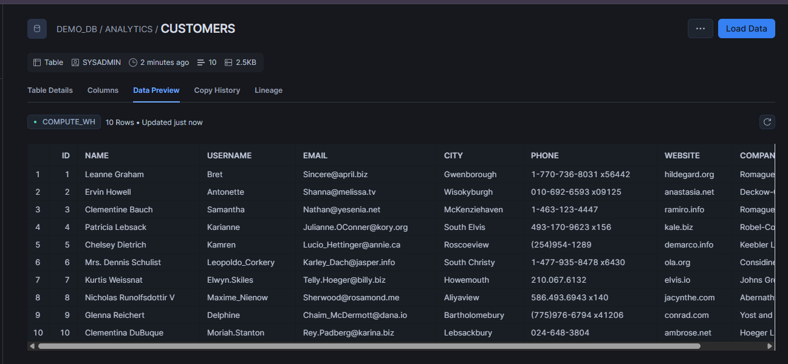

# Airflow dbt Snowflake ELT Pipeline

This project demonstrates a small end-to-end ELT pipeline using Airflow, Snowflake, dbt, and Docker Compose.

The pipeline extracts user data from a public REST API, stores the raw data, loads it into Snowflake, transforms it with dbt, and validates the result with dbt tests.

## Architecture

```text
API -> local JSON -> Snowflake RAW.raw_users -> dbt -> Snowflake ANALYTICS.customers -> dbt tests
```

## Pipeline Flow

Airflow orchestrates four tasks:

```text
extract_data -> load_raw_data -> run_dbt -> run_dbt_tests
```

- `extract_data` calls the JSONPlaceholder users API and saves the response to `include/raw_users.json`.
- `load_raw_data` reads the JSON file and loads it into `DEMO_DB.RAW.raw_users` in Snowflake.
- `run_dbt` runs `dbt run` to transform raw records into the curated `DEMO_DB.ANALYTICS.customers` table.
- `run_dbt_tests` runs `dbt test` to validate source and model quality.

## Components

- Airflow schedules and orchestrates the pipeline.
- Postgres stores Airflow metadata such as DAG runs, task states, and users.
- Snowflake stores both raw and transformed data.
- dbt manages SQL transformations and data quality tests.
- Docker Compose runs the local Airflow and Postgres services.

## Snowflake Layout

```text
DEMO_DB.RAW.raw_users
DEMO_DB.ANALYTICS.customers
```

The `RAW` schema is used for ingested source data. The `ANALYTICS` schema is used for transformed dbt models.

## dbt Model

The dbt model is defined in:

```text
dbt_project/models/customers.sql
```

It selects from the raw source table and builds a cleaned customer table in the analytics schema.

The source and tests are defined in:

```text
dbt_project/models/schema.yml
```

Current tests check that key fields such as `id` and `email` are not null, and that `id` is unique.

## Setup

Create a local `.env` file from `.env.example` and fill in your Snowflake credentials:

```bash
cp .env.example .env
```

The `.env` file is intentionally ignored by git. `docker-compose.yml` reads those values and passes them to Airflow and dbt.

Start the project:

```bash
docker compose up -d --build
```

Open Airflow:

```text
http://localhost:8080
```

Default local login:

```text
admin / admin
```

## Summary

This is an ELT pipeline. Airflow handles orchestration, Snowflake is the data warehouse, and dbt handles transformation and testing. Raw API data lands in the `RAW` schema, while curated analytics data is built in the `ANALYTICS` schema.

In production, the next improvements would be moving secrets to a managed secrets backend, adding incremental loading, improving error handling, and managing Snowflake objects with migrations or infrastructure-as-code.

## Screenshot





